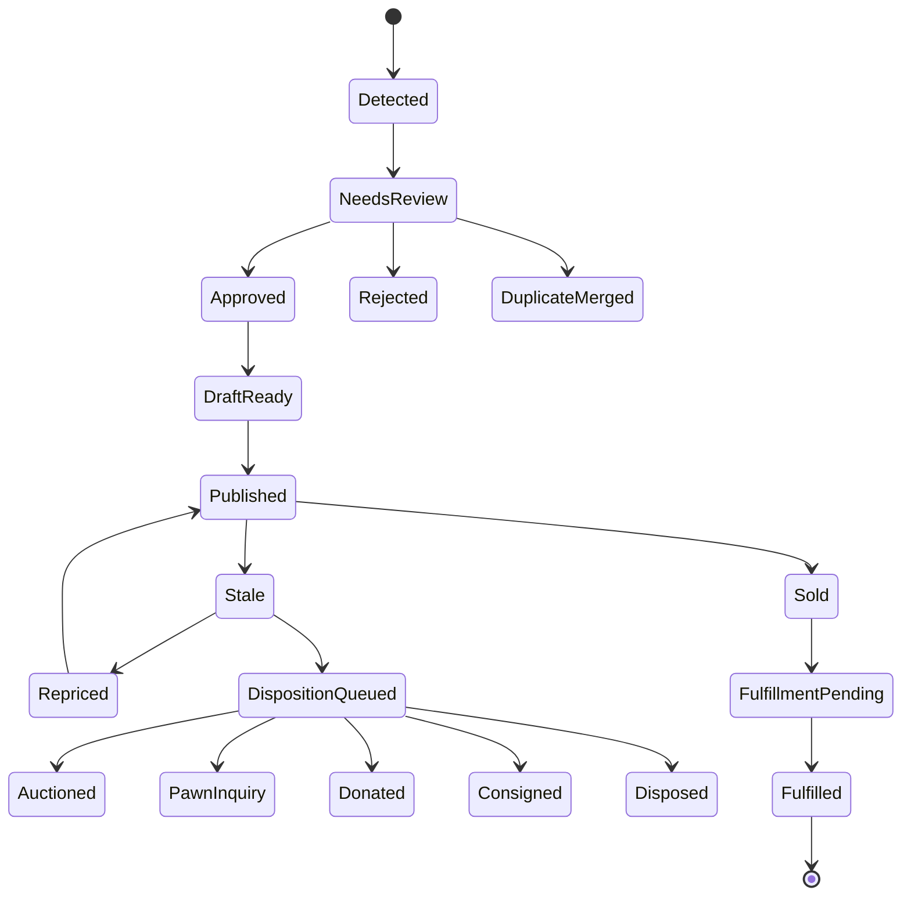
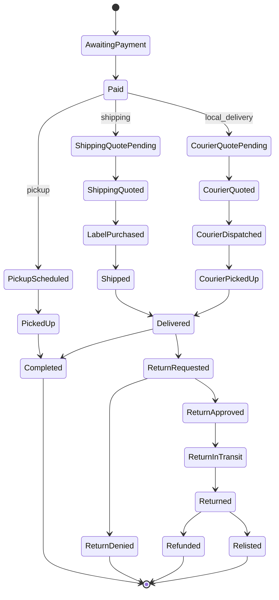
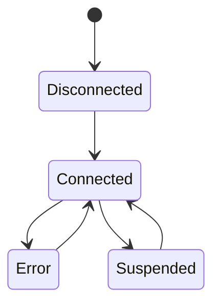

# Estate Sale App MVP PRD

**Status:** Draft  
**Date:** 2026-04-17  
**Product:** Estate Sale App  
**Scope:** Review-first MVP  
**Owner:** Dani

---

## 1. Executive summary

The MVP turns a single walkthrough video into a reviewable sale workflow:

1. extract likely saleable items from the video
2. generate draft titles, attributes, condition notes, and price bands
3. let an operator review and approve items
4. publish approved items through one marketplace path
5. fulfill sold items through parcel shipping, local courier delivery, or pickup
6. route stale inventory into markdown, bundling, or disposition outreach

This is **not** a full-autonomy liquidation robot. It is an **operator acceleration** product.

### Product thesis

**One walkthrough video becomes structured inventory, sale-ready listing drafts, and an exit plan for unsold items.**

---

## 2. Key product decisions

### Core MVP posture
- **Review first, not auto-publish**
- **One marketplace path in MVP**
- **Operators ship on their own behalf**
- **No Pirate Ship in the plan**
- **Shippo for parcel shipping**
- **Uber Direct for local delivery**
- **DoorDash Drive later, behind a feature flag / approval gate**
- **Stale inventory routed through semi-automated outreach, not full API integrations**

### Why these decisions exist
- Condition, authenticity, and pricing still need human review.
- Marketplace automation is fragmented and operationally risky.
- Parcel shipping is best handled through an API-native provider.
- Local courier delivery is a dispatch problem, not a postage-label problem.
- Disposition channels like pawn, auction, thrift, and donation are still relationship-driven.

---

## 3. Goals and non-goals

### Goals
- Reduce time to inventory a property.
- Reduce operator effort spent on photos, titles, descriptions, and categorization.
- Create a publishable review queue from a single walkthrough.
- Support post-sale fulfillment without re-entering data.
- Recover value from stale inventory instead of dumping it blindly.

### Non-goals
- Fully autonomous listing publication with no review.
- Automated authentication of luxury, fine art, jewelry, or collectibles.
- Nationwide direct integrations with all pawn, auction, thrift, and donation networks.
- Cross-posting to every resale marketplace in v1.
- DoorDash Drive production launch in the MVP baseline.

---

## 4. Primary users

### Primary user types
- Estate sale operators
- Cleanout and liquidation companies
- Families handling inherited homes
- Resellers / consignment operators

### Jobs to be done
1. Walk through a property once and get inventory fast.
2. Avoid photographing and hand-writing every listing from scratch.
3. Publish acceptable drafts with minimal cleanup.
4. Handle sold-item fulfillment cleanly.
5. Move unsold inventory into the right next channel.

---

## 5. MVP scope

### In scope
- Property creation
- Walkthrough video upload
- Frame extraction
- Item detection and clustering
- OCR / visible brand extraction where possible
- Draft item metadata generation
- Human review queue
- Listing draft creation
- One marketplace path
- Order capture/import
- Parcel shipping via Shippo
- Local courier delivery via Uber Direct
- Buyer pickup workflow
- Returns workflow
- Stale listing detection
- Disposition recommendations
- Outreach packet generation for non-integrated channels

### Out of scope
- Autonomous posting to multiple marketplaces with no operator review
- Authentication / appraisal of luxury and high-risk categories
- DoorDash Drive production dependency at launch
- Pirate Ship
- Full CRM and messaging automation for every local buyer category
- Donation scheduling integrations nationwide

---

## 6. Success metrics

### Core metrics
- median time from upload to reviewed inventory
- percent of detected items approved after light edit
- percent of approved items published same day
- sell-through rate by property
- operator minutes saved per property
- percent of sold orders fulfilled without manual re-entry
- stale-inventory recovery rate
- percent of returned items relisted within 48 hours

---

## 7. Functional requirements

## 7.1 Walkthrough ingestion

The system shall let an operator create a property and upload one or more walkthrough videos.

The processing pipeline shall:
1. extract frames
2. detect candidate objects
3. cluster repeated sightings of the same item
4. select best images
5. run OCR / visible text extraction where possible
6. produce item drafts with confidence scores and risk flags

## 7.2 Item review

Every detected item shall enter a review queue with:
- primary image
- alternate images
- suggested title
- suggested category
- condition estimate
- key attributes
- shipping suitability
- price band
- confidence score
- duplicate suspicion
- risk flags

Mandatory review gates:
- low confidence
- high estimated value
- fragile / oversized
- branded / collectible
- unclear damage
- ambiguous category

## 7.3 Listing workflow

The system shall support:
- approve / reject detected item
- merge duplicates
- edit title, description, condition, dimensions, weight, price
- create a listing draft
- publish through one marketplace path
- store external listing identifiers and status
- mark listings stale after policy thresholds

## 7.4 Fulfillment workflow

Each sold order shall have one fulfillment mode:
- `shipping`
- `local_delivery`
- `pickup`

For `shipping`, the system shall:
- require package dimensions and weight
- retrieve rates
- purchase label
- store label artifact metadata and tracking
- process webhook / polling updates

For `local_delivery`, the system shall:
- retrieve courier estimate
- create courier delivery
- store external delivery ID and tracking URL
- print an internal handoff slip
- process webhook / polling updates
- enforce proof requirements for configured item categories

For `pickup`, the system shall:
- schedule pickup window
- store pickup instructions
- require confirmation / release check

## 7.5 Returns

The system shall support:
- return request
- operator approval or denial
- parcel return label generation for shippable items
- local courier return flow where supported
- receive / inspect / refund / relist / dispose decisions

## 7.6 Unsold disposition

When an item becomes stale, the system shall support:
- markdown recommendation
- bundling recommendation
- auction routing
- pawn inquiry routing
- thrift / donation routing
- disposal

For non-integrated channels, the system shall generate an outreach packet containing:
- photos
- title
- category
- condition
- dimensions / weight if known
- ask price / reserve guidance
- location ZIP
- operator contact info

---

## 8. Provider model and launch posture

### Shipping business model
The product is **software that helps operators ship**.  
Each operator ships on **their own behalf**.

That means:
- shipping is modeled per operator organization
- each operator connects or uses a shipping provider relationship tied to their organization
- the app orchestrates rates, labels, tracking, and returns
- the app is not positioned as a Pirate Ship wrapper or shipping-reseller front end

### Parcel shipping
**Launch provider: Shippo**

Why:
- API-native workflow
- rate shopping
- label creation
- return labels
- tracking webhooks
- carrier account support
- scalable path from low-volume MVP to larger operator accounts

### Local courier
**Launch provider: Uber Direct**

Why:
- API-native estimate and dispatch flow
- proof-of-delivery options
- webhook/status support
- viable for same-day local delivery and local return legs

### Later / optional provider
**DoorDash Drive**

Why it is not launch-critical:
- useful local courier option
- but still gated operationally
- should not block MVP launch

### Explicitly removed
- Pirate Ship
- PirateShipAdapter
- manual copy/paste label workflow
- Pirate Ship pricing rows
- Pirate Ship return flows

---

## 9. Pricing and commercial notes

These numbers are planning inputs, not product UI copy.

### Parcel shipping options
- **Shippo API Starter**: 30 labels/month free, then 7¢ per label after the first 30
- **ShipStation API Advanced**: $75/month for 1,000 labels, then overage pricing by tier
- **ShipStation API Free**: possible later option if its scope matches the operator workflow, but not assumed for MVP
- **Pirate Ship**: removed from the automated plan

### Local courier options
- **Uber Direct**: quote-based; price must be estimated live when the order is ready
- **DoorDash Drive**: public pricing is distance-based, but launch depends on production access approval

### Storage consequences
The system must store its own immutable snapshots for:
- shipping rates
- courier quotes
- label purchases
- tracking references
- fee breakdowns

Do **not** depend on third-party APIs as the long-term system of record.

---

## 10. End-to-end workflows

## Workflow A — Create inventory from walkthrough

1. Operator creates property.
2. Operator uploads walkthrough video.
3. System extracts frames and candidate items.
4. System clusters duplicate sightings of the same item.
5. System selects best images.
6. System drafts title, category, attributes, condition estimate, and price band.
7. Items enter review queue.
8. Operator approves, rejects, or merges items.
9. Approved items become listing drafts.

**Success condition:** a usable, reviewable inventory exists without manually photographing every item.

## Workflow B — Publish listing

1. Operator opens approved draft.
2. Operator edits title, condition, dimensions, shipping mode, and price.
3. System maps fields into the chosen marketplace/export schema.
4. Operator publishes.
5. System stores listing status and external references.

**Success condition:** the item is externally listed and internally traceable.

## Workflow C — Parcel shipping after sale

1. Order is marked paid.
2. Operator confirms package dimensions and weight.
3. App retrieves Shippo rates.
4. Operator or rules engine selects a rate.
5. App purchases label.
6. App stores shipment snapshot, rate snapshot, transaction ID, label URL, and tracking number.
7. App prints carrier label and packing slip.
8. Tracking updates arrive by webhook or polling.
9. If needed, app creates a return label tied to the order.

**Success condition:** sold item is shipped without manual re-entry.

## Workflow D — Local courier delivery after sale

1. Order is marked paid.
2. App requests an Uber Direct estimate.
3. Operator confirms the quote before it expires.
4. App creates the courier delivery.
5. App prints an internal handoff slip.
6. Courier pickup and dropoff events update order state.
7. Proof-of-delivery is required for configured categories.
8. If a local return is initiated and supported, app creates the reverse courier leg.

**Success condition:** local delivery is dispatched programmatically and tracked inside the order workflow.

## Workflow E — Pickup after sale

1. Order is marked paid.
2. Operator schedules a pickup window.
3. Buyer receives pickup instructions.
4. Operator verifies pickup and marks item released.

**Success condition:** buyer pickup is auditable and controlled.

## Workflow F — Stale inventory routing

1. Listing crosses stale threshold.
2. App suggests markdown or bundle.
3. Operator chooses:
   - reprice
   - bundle
   - auction
   - pawn inquiry
   - thrift / donation
   - dispose
4. App generates outreach packet.
5. Operator sends outreach or executes next step.
6. Outcome is logged.

**Success condition:** unsold inventory has an explicit next state instead of falling off the system.

---

## 11. State machines

### 11.1 Item lifecycle



### 11.2 Order / fulfillment lifecycle



### 11.3 Shipping connection lifecycle



### 11.4 Core enums

```text
ItemReviewState: detected | needs_review | approved | rejected | duplicate_merged
ListingState: draft_ready | published | sold | stale | archived
FulfillmentMode: shipping | local_delivery | pickup
FulfillmentState: awaiting_payment | paid | quoted | label_purchased | courier_dispatched | shipped | delivered | picked_up | completed | return_requested | returned | refunded
DispositionState: none | markdown | bundled | auction | pawn_inquiry | consignment | donation | disposal
ParcelProvider: shippo
CourierProvider: uber_direct | doordash_drive
ShippingConnectionState: disconnected | connected | error | suspended
```

---

## 12. API draft

### Conventions
- REST + JSON
- idempotency required on label purchase and courier dispatch
- provider payload snapshots stored internally
- external IDs stored verbatim
- provider webhooks ingested through dedicated endpoints

## 12.1 Core endpoints

| Method | Path | Purpose |
|---|---|---|
| `POST` | `/v1/properties` | Create property |
| `POST` | `/v1/properties/{propertyId}/walkthroughs` | Register walkthrough upload |
| `POST` | `/v1/walkthroughs/{walkthroughId}/process` | Start processing |
| `GET` | `/v1/walkthroughs/{walkthroughId}` | Get processing status |
| `GET` | `/v1/items?propertyId=...&state=needs_review` | Review queue |
| `PATCH` | `/v1/items/{itemId}` | Edit item fields |
| `POST` | `/v1/items/{itemId}/approve` | Approve item |
| `POST` | `/v1/items/{itemId}/reject` | Reject item |
| `POST` | `/v1/items/{itemId}/merge` | Merge duplicates |
| `POST` | `/v1/listings` | Create listing draft |
| `POST` | `/v1/listings/{listingId}/publish` | Publish listing |
| `GET` | `/v1/listings/{listingId}` | Listing status |
| `POST` | `/v1/orders` | Create/import order |
| `POST` | `/v1/orders/{orderId}/shipping/quote` | Retrieve parcel rates |
| `POST` | `/v1/orders/{orderId}/shipping/purchase-label` | Buy label |
| `POST` | `/v1/orders/{orderId}/shipping/return-label` | Create return label |
| `GET` | `/v1/orders/{orderId}/shipping` | Shipment status |
| `POST` | `/v1/orders/{orderId}/courier/estimate` | Retrieve local-delivery estimate |
| `POST` | `/v1/orders/{orderId}/courier/dispatch` | Create local delivery |
| `GET` | `/v1/orders/{orderId}/courier` | Courier delivery status |
| `POST` | `/v1/orders/{orderId}/pickup/schedule` | Schedule pickup |
| `POST` | `/v1/orders/{orderId}/returns` | Request return |
| `POST` | `/v1/orders/{orderId}/returns/{returnId}/approve` | Approve return |
| `POST` | `/v1/items/{itemId}/disposition/recommend` | Get disposition options |
| `POST` | `/v1/items/{itemId}/disposition/outreach-packet` | Generate outreach packet |

## 12.2 Organization provider endpoints

| Method | Path | Purpose |
|---|---|---|
| `POST` | `/v1/organizations/{orgId}/shipping-connections/shippo` | Create Shippo connection |
| `POST` | `/v1/organizations/{orgId}/shipping-connections/shippo/validate` | Validate Shippo connection |
| `DELETE` | `/v1/organizations/{orgId}/shipping-connections/{connectionId}` | Remove shipping connection |
| `POST` | `/v1/organizations/{orgId}/courier-connections/uber-direct` | Create Uber Direct connection |
| `POST` | `/v1/organizations/{orgId}/courier-connections/uber-direct/validate` | Validate Uber Direct connection |

## 12.3 Webhook endpoints

| Method | Path | Purpose |
|---|---|---|
| `POST` | `/v1/webhooks/shippo` | transaction + tracking events |
| `POST` | `/v1/webhooks/uber-direct` | courier delivery status events |
| `POST` | `/v1/webhooks/doordash-drive` | optional future courier events |

## 12.4 Example request — shipping quote

```json
{
  "fulfillment_mode": "shipping",
  "package": {
    "weight_oz": 64,
    "length_in": 18,
    "width_in": 14,
    "height_in": 10
  },
  "ship_from_location_id": "loc_123",
  "ship_to": {
    "name": "Buyer Name",
    "line1": "123 Main St",
    "city": "San Rafael",
    "state": "CA",
    "postal_code": "94901",
    "country": "US"
  }
}
```

## 12.5 Example response — shipping quote

```json
{
  "order_id": "ord_123",
  "fulfillment_mode": "shipping",
  "quotes": [
    {
      "provider": "shippo",
      "provider_quote_id": "rate_abc",
      "carrier": "USPS",
      "service": "Priority",
      "amount_cents": 1295,
      "currency": "USD",
      "estimated_days": 2
    }
  ],
  "quote_snapshot_id": "qs_123"
}
```

## 12.6 Example request — courier dispatch

```json
{
  "fulfillment_mode": "local_delivery",
  "provider": "uber_direct",
  "pickup_location_id": "loc_123",
  "dropoff": {
    "name": "Buyer Name",
    "phone": "+14155550123",
    "address": {
      "line1": "123 Main St",
      "city": "San Rafael",
      "state": "CA",
      "postal_code": "94901",
      "country": "US"
    }
  },
  "proof_policy": {
    "signature_required": true,
    "photo_required": false,
    "pin_required": true
  }
}
```

---

## 13. Provider adapter contracts

```ts
interface ParcelProvider {
  quoteShipment(input: ParcelQuoteInput): Promise<ParcelQuote[]>;
  buyLabel(input: BuyLabelInput): Promise<ParcelLabelPurchase>;
  createReturnLabel(input: ReturnLabelInput): Promise<ReturnLabelResult>;
  refundLabel?(input: RefundLabelInput): Promise<RefundLabelResult>;
  getTracking(input: TrackingLookupInput): Promise<TrackingSnapshot>;
}

interface LocalCourierProvider {
  quoteDelivery(input: CourierQuoteInput): Promise<CourierQuote>;
  createDelivery(input: CourierCreateInput): Promise<CourierDelivery>;
  cancelDelivery?(input: CourierCancelInput): Promise<void>;
  createReturn?(input: CourierReturnInput): Promise<CourierDelivery>;
  getDeliveryStatus(input: CourierStatusInput): Promise<CourierStatusSnapshot>;
}
```

---

## 14. Schema draft

## 14.1 Core tables

### organizations
- `id`
- `name`
- `type`
- `default_shipping_provider`
- `default_courier_provider`
- `created_at`
- `updated_at`

### shipping_provider_connections
- `id`
- `organization_id`
- `provider`
- `credentials_ref`
- `account_mode`
- `status`
- `last_validated_at`
- `created_at`
- `updated_at`

### courier_provider_connections
- `id`
- `organization_id`
- `provider`
- `credentials_ref`
- `status`
- `last_validated_at`
- `created_at`
- `updated_at`

### properties
- `id`
- `organization_id`
- `address_json`
- `zip_code`
- `sale_deadline`
- `liquidation_goal`
- `created_at`
- `updated_at`

### walkthroughs
- `id`
- `property_id`
- `video_url`
- `status`
- `duration_sec`
- `frame_count`
- `processing_summary_json`
- `created_at`
- `updated_at`

### rooms
- `id`
- `property_id`
- `name`
- `sequence`

### items
- `id`
- `property_id`
- `walkthrough_id`
- `room_id`
- `category`
- `title_ai`
- `title_final`
- `condition_ai`
- `condition_final`
- `confidence`
- `review_state`
- `listing_state`
- `fulfillment_mode`
- `price_low_cents`
- `price_high_cents`
- `ask_price_cents`
- `risk_flags_json`
- `created_at`
- `updated_at`

### item_images
- `id`
- `item_id`
- `source_frame_ms`
- `image_url`
- `is_primary`
- `quality_score`

### item_attributes
- `id`
- `item_id`
- `attributes_json`

### listing_drafts
- `id`
- `item_id`
- `title`
- `description`
- `condition_text`
- `marketplace_payload_json`
- `status`
- `created_at`
- `updated_at`

### marketplace_listings
- `id`
- `item_id`
- `channel`
- `external_listing_id`
- `external_url`
- `status`
- `published_at`
- `last_synced_at`

### orders
- `id`
- `item_id`
- `buyer_json`
- `sale_price_cents`
- `status`
- `fulfillment_mode`
- `payment_status`
- `placed_at`
- `paid_at`

### shipment_quotes
- `id`
- `order_id`
- `provider`
- `provider_quote_id`
- `quote_snapshot_json`
- `selected`
- `expires_at`
- `created_at`

### shipments
- `id`
- `order_id`
- `provider`
- `provider_shipment_id`
- `provider_rate_id`
- `provider_transaction_id`
- `label_url`
- `label_format`
- `tracking_number`
- `shipment_snapshot_json`
- `rate_snapshot_json`
- `label_snapshot_json`
- `purchased_at`
- `status`

### courier_quotes
- `id`
- `order_id`
- `provider`
- `provider_quote_id`
- `quote_snapshot_json`
- `expires_at`
- `created_at`

### courier_deliveries
- `id`
- `order_id`
- `provider`
- `provider_delivery_id`
- `tracking_url`
- `status`
- `fee_snapshot_json`
- `proof_policy_json`
- `created_at`
- `updated_at`

### return_requests
- `id`
- `order_id`
- `mode`
- `reason`
- `status`
- `provider_reference`
- `approved_at`
- `received_at`

### disposition_jobs
- `id`
- `item_id`
- `state`
- `recommended_channels_json`
- `selected_channel`
- `outreach_packet_url`
- `created_at`
- `updated_at`

### outreach_attempts
- `id`
- `disposition_job_id`
- `channel_type`
- `target_name`
- `contact_json`
- `status`
- `sent_at`
- `response_at`

### provider_events
- `id`
- `provider`
- `provider_event_id`
- `event_type`
- `payload_json`
- `received_at`
- `processed_at`

## 14.2 Recommended indexes
- `items(property_id, review_state)`
- `items(property_id, listing_state)`
- `marketplace_listings(channel, external_listing_id)`
- `orders(item_id)`
- `shipments(tracking_number)`
- `courier_deliveries(provider, provider_delivery_id)`
- `provider_events(provider, provider_event_id)` unique

## 14.3 Key nullable / non-nullable choices
- `condition_ai` nullable
- `condition_final` nullable until reviewed
- `fulfillment_mode` required before publish
- dimensions / weight nullable until required by fulfillment path
- provider IDs nullable until third-party creation succeeds

---

## 15. Business rules

1. Never auto-publish high-risk items.
2. Never buy a shipping label without confirmed dimensions and weight.
3. Never dispatch a courier without an accepted quote or approved cost path.
4. Use idempotency keys for label purchases and courier dispatches.
5. Persist all provider quote/rate/label/delivery snapshots internally.
6. If an organization has no active Shippo connection, do not offer parcel shipping for that organization.
7. Use proof-of-delivery on configured high-value local deliveries and returns.
8. Treat DoorDash as backlog / feature-flag work until production approval is actually obtained.
9. Stale inventory must move to an explicit next state.

---

## 16. Implementation notes

### Human-in-the-loop defaults
Default to human approval for:
- condition
- price
- fragile items
- branded / collectible items
- oversized shipping suitability
- disposition choice for unsold inventory

### Data retention / audit
Store:
- original provider quote payloads
- selected rate payloads
- purchased label payloads
- courier estimate payloads
- courier delivery payloads
- webhook payloads

### Print artifacts
- **Parcel shipping:** print carrier label + packing slip
- **Local delivery:** print internal handoff slip, not a postage label
- **Pickup:** print or display release verification details

---

## 17. Open product questions

These should be resolved after MVP scope is locked, not before:
1. Which marketplace path is the single MVP publish target?
2. Do operators connect their own carrier accounts inside Shippo, or do they use Shippo carrier accounts by default?
3. Which item categories are automatically forced into `pickup` or `local_delivery`?
4. What is the stale threshold by category?
5. Which disposition channels should get outreach templates first?

---

## 18. Release plan

### Phase 1
- property + walkthrough upload
- frame extraction
- detected items
- review queue
- listing drafts

### Phase 2
- one marketplace path
- order import / creation
- Shippo parcel shipping
- Uber Direct local delivery
- pickup flow
- webhook ingestion

### Phase 3
- returns
- stale inventory detection
- disposition engine
- outreach packet generation
- DoorDash feature flag groundwork

---

## 19. Current external validation notes

As of 2026-04-17, the current provider assumptions used in this PRD are:

- Shippo API Starter publicly shows **30 free labels/month**, then **7¢ per label**
- Shippo states **Shipment** and **Rate** objects are only retrievable for **390 days** after creation
- Shippo supports connecting your own carrier accounts and also offers platform-account paths if the product model changes later
- Uber Direct estimate responses include an `expires_at`; current docs say estimates last **15 minutes**
- Uber Direct supports proof-of-delivery for pickup, delivery, and return
- DoorDash Drive says production access is currently restricted
- DoorDash Drive quotes must be accepted within **5 minutes**
- DoorDash Drive public pricing says **$9.75 within 5 miles** and **+$0.75/mile** beyond 5 miles up to 15 miles
- ShipStation API Advanced publicly lists **$75/month for 1,000 labels**, with overage pricing after that

---

## 20. Reference URLs

### Shippo
- https://goshippo.com/pricing/api
- https://docs.goshippo.com/docs/api_concepts/apichangelog
- https://docs.goshippo.com/docs/carriers/carrieraccounts
- https://docs.goshippo.com/docs/guides_general/generate_shipping_label
- https://docs.goshippo.com/docs/shipments/returns
- https://docs.goshippo.com/docs/tracking/webhooks

### Uber Direct
- https://developer.uber.com/docs/deliveries/overview
- https://developer.uber.com/docs/deliveries/direct/api/v1/post-eats-deliveries-estimates
- https://developer.uber.com/docs/deliveries/guides/proof-of-delivery

### DoorDash Drive
- https://developer.doordash.com/en-US/docs/drive/overview/pricing_payment/
- https://developer.doordash.com/docs/drive/how_to/get_production_access/
- https://developer.doordash.com/docs/drive/how_to/quote_deliveries/

### ShipStation API
- https://www.shipengine.com/pricing/
- https://help.shipengine.com/hc/en-us/articles/19326509952027-Advanced-Plan
