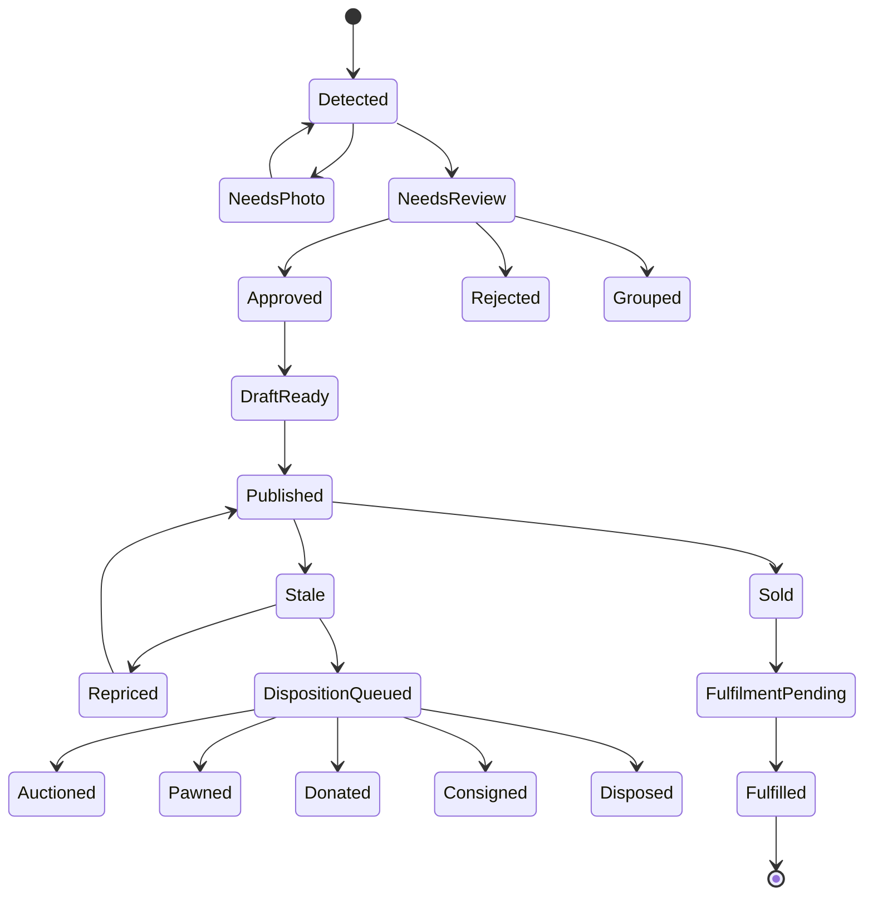
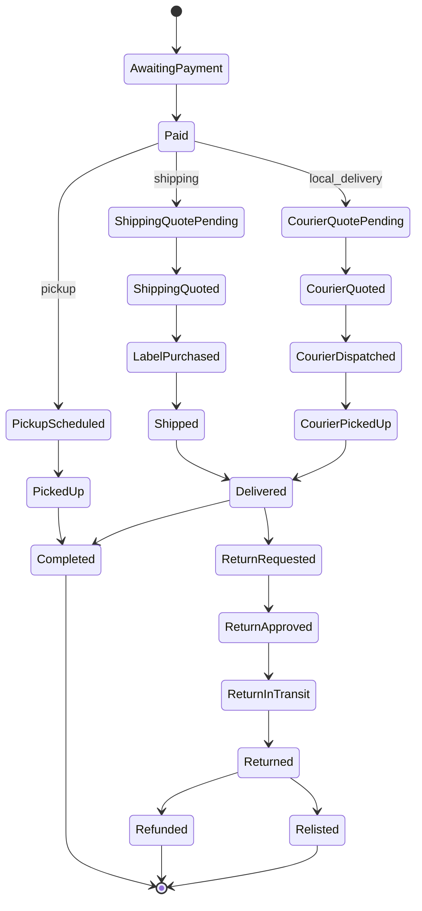

# Revised MVP PRD – Estate‑Sale App (2026)

## 1 Overview

This document presents a **revised Minimum Viable Product (MVP) Product‑Requirements Document (PRD)** for an estate‑sale application.  It incorporates lessons from earlier planning, recent marketplace developments, and a decision memo mandating an Apple‑first development stack.  The goals are to take a **walkthrough video or photo of items**, automatically generate draft listings, allow human review, post to appropriate marketplaces, manage fulfillment, and build a profitable shipping layer.  The product is designed for users aged **45 and older**, so the user experience must be simple, with minimal button taps and clear flows.

### Key differences from earlier drafts

- **Shipping as a platform feature:**  The app now sells shipping itself rather than requiring every operator to connect their own shipping account.  This means the platform needs a white‑label multi‑carrier shipping API (e.g., EasyPost Forge) and must manage label purchases, tracking and returns centrally.
- **One marketplace in MVP:**  Automatic publishing will target **eBay** first.  Cross‑listing to Facebook Marketplace happens through eBay’s partnership and requires shipping enabled; currently only shipped listings appear on Facebook 【81456078629788†L287-L291】.  Mercari and Poshmark remain assisted or manual channels because official seller APIs or blanket cross‑listing programs are unavailable or limited to specific seller levels.  Poshmark requires the use of its prepaid shipping labels 【323986678136004†L134-L158】; Mercari allows “ship on your own” but items shipped outside Mercari’s prepaid label system lose Shipping Protection 【756379886856556†L42-L54】.  These restrictions make a unified platform‑owned shipping path challenging across all channels.
- **iOS/Swift implementation:**  The app will be built natively using **Swift** and **SwiftUI**, with **Xcode 26.3+** as the canonical environment.  Shared code will live in Swift packages.  Commodity infrastructure (auth, storage, push notifications, analytics) will be bought rather than built.  This aligns with the decision memo’s guidance to **“build the product, buy the plumbing”** and to use **Xcode Cloud**, **swift-format**, **SwiftLint**, and **XCTest** as hard gates.

## 2 Goals and Objectives

1. **Turn a single video or photo set into sale‑ready listings.**  Reduce the manual effort of photographing, categorising and posting estate‑sale inventory.
2. **Simplify the seller experience for older users (45+).**  Present clear actions (e.g., *Take Photos* or *Record Walkaround*) and minimise screens and fields.  Default to sensible marketplace, pricing and shipping options while allowing edits during review.
3. **Sell shipping as a value‑added service.**  The platform provides prepaid labels via a white‑label multi‑carrier API.  Sellers are billed through the app, and buyers pay shipping at checkout.  The app handles tracking and returns centrally.
4. **Manage unsold inventory gracefully.**  Detect stale listings, suggest markdowns or bundling, and assist with donation or disposal.

## 3 Primary Users and Use Cases

### 3.1 Primary users

- **Estate‑sale operators / liquidation companies:**  Need to rapidly inventory homes and sell items across channels.
- **Householders managing inherited homes:**  Often first‑time sellers, looking for guidance and minimal complexity.
- **Professional consignment resellers:**  Handle many small items and appreciate automation.

### 3.2 Core jobs to be done

1. **Capture items quickly:**  Upload a photo or record a video walkthrough.  Let the system detect objects and extract key frames.
2. **Generate draft listings:**  Use vision + transcript analysis to propose titles, categories, and conditions.  Suggest price ranges and shipping methods.
3. **Human review:**  Present each draft with hero photos, key details and suggested price.  Allow quick approval, editing or rejection.  Group duplicate items or sets.
4. **Publish to marketplaces:**  For the MVP, automatically list on **eBay** with shipping enabled.  Cross‑listing to Facebook Marketplace happens via eBay’s partnership for shipped items 【81456078629788†L287-L292】.  Offer manual assistance for Mercari or Poshmark.
5. **Fulfil orders:**  When an item sells, purchase a shipping label through the platform’s multi‑carrier API and provide tracking.  For local buyers, offer Uber Direct as a same‑day courier.  Poshmark and Mercari prepaid labels must be honoured on those channels.
6. **Handle returns and unsold items:**  Support buyer returns (where marketplace rules apply) and mark items as relisted, donated, consigned or disposed.

## 4 Corrected Channel Matrix

The MVP will support one first‑class channel (eBay) with cross‑promotion to Facebook via eBay’s partnership and provide assisted flows for Mercari and Poshmark.  Future phases may add more channels if APIs mature.

### Marketplace capabilities (2026)

| Channel | API/Integration status | Shipping rules | Return policy notes | MVP behaviour |
|---|---|---|---|---|
| **eBay** | Official Inventory & Fulfilment APIs; partnership with Facebook Marketplace | Sellers can choose shipping carriers.  Listings with shipping options are automatically cross‑posted to Facebook Marketplace 【81456078629788†L287-L291】. | eBay Money‑Back Guarantee still applies even if seller states “no returns”; sellers must handle item‑not‑as‑described claims. | **Primary channel.** App posts listings automatically; shipping labels purchased via platform API; cross‑listing to Facebook uses eBay integration. |
| **Facebook Marketplace (via eBay)** | Not a standalone API; cross‑listing happens through eBay partnership. | Only listings with shipping options are shown 【81456078629788†L287-L291】.  Local pick‑up listings are currently excluded. | Transactions handled through eBay checkout; buyer receives eBay’s protections 【81456078629788†L294-L296】. | **Automatic promotion** of eBay listings when available.  No separate listing creation in MVP. |
| **Mercari** | No general seller API for cross‑listing; imports available from eBay/Poshmark/Depop on desktop only 【526926948132116†L14-L29】. | Sellers can use Mercari prepaid labels (with protection) or ship on their own; shipping on your own voids Mercari Shipping Protection 【756379886856556†L42-L54】. | Returns allowed if item not as described; shipping protection covered only on prepaid labels 【756379886856556†L34-L54】. | **Assisted channel:** After review, operator may export data and manually import into Mercari using its import tool on desktop.  The app warns sellers that using their own labels forfeits Mercari shipping protection. |
| **Poshmark** | No public API; Bulk Upload available only to Posh Ambassadors and Brand Partners (not accessible by default). | Poshmark sends sellers a **prepaid, pre‑addressed shipping label** automatically after sale 【323986678136004†L134-L158】.  Sellers cannot use their own labels. | All sales are final except where items are not as described (buyer protection still applies). | **Manual channel:** The app cannot auto‑publish to Poshmark.  If sellers wish to list, they must use Poshmark’s interface and accept its shipping labels.  Return policies remain enforced. |
| **Mercari Local / Uber** | Local delivery option powered by Uber; on‑demand with no packaging required 【992649034037259†L30-L48】. | Only available on Mercari platform; not open for external posting. | Standard Mercari protections apply. | Out of scope for MVP; referenced to show Uber’s ability to handle C2C local delivery. |
| **Other marketplaces** | Many resale platforms lack official APIs or require partnership. | Shipping and return rules vary. | Unknown or highly manual. | Defer until official APIs or partnerships become available. |

## 5 Functional Requirements

### 5.1 Capture and item detection

1. **Capture modes:**  Provide two entry points: **Take Photos** for single‑item flow and **Record Walkaround** for multi‑item intake.  Ask the user to show labels and mention the item name/brand/flaws in the video; this audio helps classification but does not directly create listings.  The app should not expose diarisation complexity to users.
2. **Video processing:**
   * Extract frames and detect objects using open‑vocabulary detectors.  Track objects across frames and cluster them into **CandidateItem** entities.
   * Identify candidate items using a combination of barcode/ISBN/UPC scans, OCR of model plates or tags, image embedding retrieval and category‑specific models.
   * Align transcript mentions with visual tracks to enrich metadata (brand, model, quantity) rather than to create listings outright.
   * For each CandidateItem, choose multiple keyframes: a hero image, label/tag close‑up, defect image and additional angles.  Use sharpness, occlusion and glare scoring to pick the best frame per angle cluster.
3. **Photo capture:**  For single‑item photos, allow multiple shots and encourage one main photo plus close‑ups of labels and flaws.  If detection confidence is low, prompt the user to retake photos or add an extra close‑up instead of silently guessing.
4. **Item classification:**  Use a two‑stage taxonomy.  Stage 1 filters for saleable categories (e.g., furniture, electronics, books/media, apparel, tools, jewellery).  Stage 2 uses category‑specific classifiers and external lookups to identify brand, model number, style, material, era and other attributes.  For example, books use barcode scanning; electronics rely on model‑plate OCR; apparel uses garment tag recognition; vintage decor uses style descriptors.
5. **Condition suggestion:**  Evaluate seal visibility, packaging, visible wear and transcript mentions to suggest conditions (new in box, open box, used with flaws, untested, for parts).  Provide a confidence score and evidence indicators (e.g., “seal visible: yes”, “power‑on observed: no”).  Default to conservative descriptions when evidence is weak.

### 5.2 Listing generation and review

1. **CandidateItem → ListingDraft:**  Each CandidateItem becomes a ListingDraft only after visual confirmation.  CandidateItems identified solely by transcript (without matching visual track) remain in a “needs photo” state until the seller captures a photo.  Bundles (e.g., sets of chairs) are modelled via a **CandidateGroup** entity.
2. **Draft contents:**  A draft contains a title, category, suggested price range, condition description, attributes, shipping recommendations, hero image and secondary images.  The system should also flag prohibited items and require manual confirmation.
3. **Review queue:**  Present each draft in a card‑style UI with two buttons: **Looks Good** (accept), **Fix** (edit title/condition/price), and **Not Selling** (reject).  For duplicate or bundled items, provide a “Group” action.  Hide advanced marketplace fields unless needed.
4. **Approval → ListingDraftReady:**  Approved drafts move to a state where they can be published.  Rejected drafts are archived; grouped items combine into a single listing.

### 5.3 Publishing to marketplaces

1. **eBay integration:**  Implement eBay’s Inventory & Offer APIs to create and manage listings.  Use the app’s platform‑owned shipping account to set shipping options.  Set condition codes conservatively and attach custom item specifics.
2. **Facebook promotion via eBay:**  The app does not call Facebook directly; instead, shipping‑enabled eBay listings will automatically appear on Facebook Marketplace 【81456078629788†L287-L292】.  The app should ensure shipping options are always present for eligible items.
3. **Mercari assistance:**  Provide an export function (CSV or JSON) for selected drafts with images.  The user can import these via Mercari’s desktop cross‑listing tool (which only supports imports from eBay, Poshmark and Depop 【526926948132116†L14-L29】).  Warn users that shipping on their own will void Mercari Shipping Protection 【756379886856556†L42-L54】.
4. **Poshmark guidance:**  Offer manual instructions and asset export.  Remind users that Poshmark will email a prepaid, pre‑addressed label once the item sells and that sellers must use that label 【323986678136004†L134-L158】.
5. **Listing state management:**  When an item sells on any channel, mark the corresponding ListingDraft and all other active ChannelListings as **sold** and **delist** them.  This prevents selling the same item twice.

### 5.4 Order, fulfilment and shipping

1. **Fulfilment modes:**  Each order must be assigned a `fulfilment_mode`:
   - `shipping` (default on eBay and cross‑posted listings)
   - `local_delivery` (via Uber Direct when the buyer is within the same metropolitan area)
   - `pickup` (for bulky items sold locally)
2. **Shipping provider:**  Use a platform white‑label multi‑carrier API (e.g., EasyPost Forge) to obtain rates, purchase labels and track shipments.  Persist all quote snapshots, rates and fee breakdowns because providers may limit data retention.
3. **Label purchase:**  After payment confirmation, calculate package dimensions and weight.  Choose the best rate based on speed and cost.  Purchase the label using the platform’s account.  Store `label_url`, `tracking_number` and cost details.  For eBay, ensure tracking is uploaded to the order.
4. **Local delivery via Uber Direct:**  Request a delivery quote, display estimated fees and expiration time, and create a delivery once confirmed.  Print an internal hand‑off slip (not a shipping label) with QR code and order details.  Require PIN/signature/photo for high‑value items.  Track courier status via webhooks.
5. **Returns:**  Support returns in compliance with channel rules.  For shipping orders, create return labels through the platform API.  For local deliveries, create a return pickup request via Uber Direct where supported.  Update inventory states accordingly.

### 5.5 Unsold inventory and disposition

1. **Stale detection:**  Flag listings that remain unsold after a configurable number of days.  Present options to markdown, bundle with similar items or move to disposition.
2. **Disposition:**  Support donation, auction, pawn, consignment or disposal.  For non‑integrated channels, generate an **outreach packet** with photos, description, dimensions and reserve price.  Track outreach attempts and outcomes.

## 6 State Model

### 6.1 Item states

### 6.2 Order & fulfilment states

## 7 Development Approach & Architecture

The decision memo mandates an **Xcode‑first, native Apple stack**, summarised here:

1. **Languages and frameworks:**  Use **Swift** and **SwiftUI** for UI, **SwiftData** (or Core Data) for local persistence and offline caching, and **Combine** for reactive flows.  Use **XCTest** for unit and UI testing.
2. **Project structure:**  Organise code into Swift packages under `Packages/`:
   - `Core`: domain models, value objects, business rules.
   - `Data`: data transfer objects (DTOs), repository implementations, API client adapters, local cache.
   - `Features`: feature modules (BrowseSales, SaleDetail, ItemReview, Publish, Fulfilment, Admin, Account).
   - `UIComponents`: reusable SwiftUI views and design tokens.
   - `Apps`: separate targets for iOS (initial), iPadOS, macOS (admin dashboard), watchOS (later), and tvOS (later).  Keep watchOS and tvOS minimal until validated.
3. **CI/CD:**  Use **Xcode Cloud** for continuous integration and deployment.  Enforce **swift-format** and **SwiftLint** to maintain code style.  Require tests to pass before merging.  Adopt **Codex** within Xcode for AI assistance, but never bypass build/test loops.
4. **Infrastructure to buy:**  Use hosted services for authentication (Supabase Auth or Firebase Auth), storage/CDN (Supabase Storage or S3), push notifications (APNs via backend), crash reporting and analytics (Sentry, PostHog).  Use Sign in with Apple and Google; the app UI should show which method the user last used when signing back in.
5. **Infrastructure to build:**  Develop the sale domain model, item taxonomy, multi‑item scheduling logic, notification rules, admin workflows, image‑quality scoring, duplicate detection and any recommendation logic.  Build a small backend (e.g., using Supabase or a typed server) to store listings, shipping data, orders and states.

## 8 Implementation Phases

### Phase 1 – MVP launch

1. **Capture and detection pipeline** for photos and videos.
2. **CandidateItem and ListingDraft models** with human review UI.
3. **eBay listing integration** with shipping enabled and automatic promotion to Facebook Marketplace.
4. **Platform shipping service** using a white‑label multi‑carrier API (e.g., EasyPost Forge) and **Uber Direct** for local deliveries.
5. **Order management and fulfilment flows** with return support.
6. **Basic admin tools** for operators to manage properties, listings and orders.
7. **Metrics collection** and crash reporting.

### Phase 2 – Operational leverage

1. Expand admin tools: bulk edits, duplicate detection, quality control.
2. Build ranking/recommendation logic to prioritise high‑value items.
3. Add seller analytics (sell‑through rates, average days to sell).
4. Introduce optional **Mercari** and **Poshmark** assisted imports with enhanced guidance.
5. Evaluate **DoorDash Drive** as a second local courier once production access is secured and gating tests are passed.

### Phase 3 – Differentiated product

1. Introduce AI‑assisted listing enhancements (style suggestions, similar‑item pricing) with strict human review.
2. Add watchOS companion for reminders and notifications; consider tvOS for in‑sale display screens.
3. Expand marketplace integrations when official APIs become available.
4. Build advanced recommendation and pricing insights modules.
5. Explore partnerships with local auctions, charities and pawn networks for unsold items.

## 9 User Experience & Accessibility

1. **Minimal cognitive load:**  Use large, clearly labelled buttons and avoid deep navigation.  Use wizard‑like flows with progress indicators.  Provide contextual help and tooltips.
2. **45+ friendly design:**  Use high‑contrast colours, large touch targets and legible fonts.  Avoid jargon; use plain language (e.g., “Take Photos”, “Record Walkaround”, “List on eBay”).  Include accessibility labels for VoiceOver.
3. **Feedback and status:**  Show progress while processing videos; summarise how many items were detected and what still requires action.  Provide confirmation screens when publishing listings or purchasing labels.
4. **Offline support:**  Cache listing drafts and images locally so users can review them even without network connectivity.  Sync when connectivity returns.
5. **Privacy:**  Do not store raw audio or full video transcripts longer than necessary.  Extract transcripts for classification and then discard audio.  Store only required personal data (names, addresses) and secure it with encryption.

## 10 Non‑Functional Requirements

1. **Performance:**  Item detection and classification should process a one‑minute video within two minutes on a mid‑range iPhone.  Photo capture should provide immediate feedback.
2. **Scalability:**  The backend must handle concurrent processing of multiple videos and support scaling as more estates are onboarded.
3. **Data retention:**  Store snapshots of shipping quotes, rates, label purchases and courier fees locally because some providers limit retention (e.g., Mercari shipping quotes expire quickly; Shippo allows retrieval of Shipment/Rate objects only for 390 days).  This ensures the platform has its own audit trail.
4. **Security:**  Use TLS for all network traffic.  Limit API keys and tokens to least privilege.  Adopt OAuth for marketplace integrations where required.
5. **Compliance:**  Respect marketplace policies (eBay and Mercari prohibited items, Poshmark fashion categories).  Provide accessible features per WCAG guidelines.

## 11 Success Metrics

1. **Median time from upload to reviewable drafts.**  Target under 3 minutes for a 1‑minute video.
2. **Review efficiency:**  Percentage of detected items that are approved with minimal edits.  Target >70 % on high‑confidence items.
3. **Sell‑through rate:**  Percentage of items sold within 30 days of listing.  Track separately for different categories and channels.
4. **Fulfilment reliability:**  Percentage of shipped orders delivered without issue (no lost or damaged packages).  Target >98 %.
5. **User satisfaction:**  Net Promoter Score (NPS) from estate‑sale operators and sellers aged 45+.  Target >70.

## 12 Open Questions & Ambiguities

1. **Choice of white‑label shipping provider:**  EasyPost Forge appears to offer a scalable white‑label platform, but commercial terms and per‑label fees need evaluation.  Shippo and ShipStation are alternatives with different pricing models.  A detailed comparison and legal review is required before committing.
2. **Cross‑listing beyond eBay:**  Should we pursue partnerships with Mercari or Poshmark to access official listing APIs once available?  In the interim, manual or semi‑automatic flows may suffice.
3. **Handling of high‑value items:**  Additional identity verification or escrow services may be required for luxury goods or fine art.  Should these items be excluded from the MVP or require manual intervention?
4. **Integration with local donation and auction partners:**  How will we onboard charities or auctions to handle unsold inventory?  Will we provide APIs or rely on email outreach with our packets?
5. **International markets:**  This PRD assumes U.S. shipping and marketplace rules.  If the business expands to other regions, localisation and different shipping/carrier rules will be necessary.

---

### References

- **Mercari cross‑listing tool:**  Mercari’s import tool only supports imports from eBay, Poshmark and Depop, and is available on desktop only 【526926948132116†L14-L29】.
- **Mercari shipping:**  Sellers using a Mercari prepaid label receive a label automatically and are covered by Mercari Shipping Protection.  If sellers ship on their own, they must provide tracking and the package does not qualify for Mercari Shipping Protection 【756379886856556†L42-L54】.
- **Poshmark shipping:**  After an item sells, Poshmark emails a prepaid, pre‑addressed shipping label to the seller; sellers cannot substitute their own label 【323986678136004†L134-L158】.
- **eBay × Facebook Marketplace:**  Only eBay listings with shipping options appear on Facebook Marketplace; local pickup listings are currently excluded 【81456078629788†L287-L291】.  Buyers complete checkout on eBay 【81456078629788†L294-L296】.
